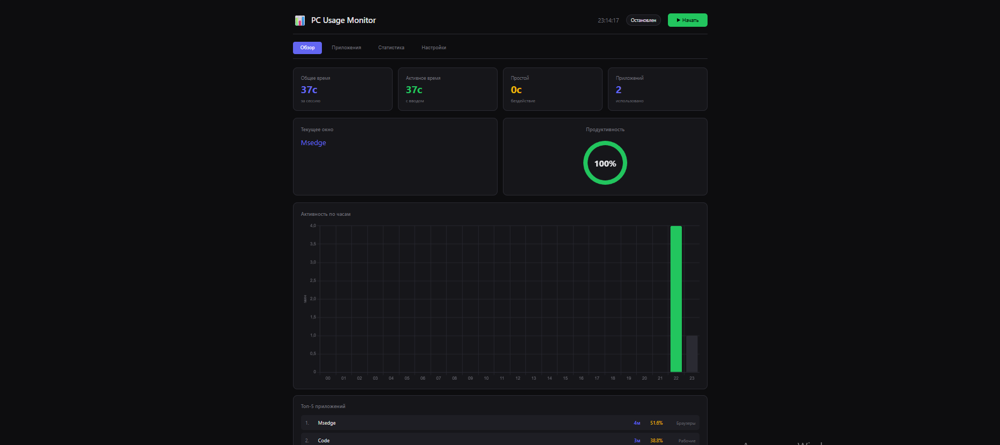

# PC Usage Monitor

Приложение для мониторинга использования компьютера на Windows. Отслеживает активное время работы, используемые программы и категоризирует их автоматически.

## О проекте

Этот проект создавался для личного использования на протяжении 2 недель. Цель — понять сколько времени уходит на работу, развлечения и другие активности за компьютером.

## Возможности

- Отслеживание активного и неактивного времени
- Мониторинг используемых приложений
- Автоматическая категоризация программ (работа, развлечения, браузеры, общение и др.)
- Почасовая статистика активности
- Графики и диаграммы использования
- Веб-интерфейс с тёмной темой
- Автозапуск при старте Windows
- Приватный режим для скрытия названий окон

## Скриншоты



## Установка

1. Клонируйте репозиторий:
```bash
git clone https://github.com/username/pc-usage-monitor.git
cd pc-usage-monitor
```

2. Запустите приложение:
```bash
python main.py
```

3. Откройте в браузере: http://localhost:8080

## Требования

- Windows 10/11
- Python 3.8+

Внешние зависимости не требуются, используются только стандартные библиотеки Python.

## Структура проекта

```
├── main.py          # Точка входа
├── config.py        # Настройки и категории
├── database.py      # Работа с SQLite
├── tracker.py       # Отслеживание окон через WinAPI
├── collector.py     # Сбор данных
├── server.py        # HTTP сервер и API
├── autostart.py     # Управление автозапуском
├── static/
│   ├── index.html   # Веб-интерфейс
│   ├── style.css    # Стили
│   └── app.js       # Логика фронтенда
└── data/            # База данных (создаётся автоматически)
```

## Использование

После запуска приложение автоматически начинает мониторинг и открывает браузер со статистикой.

**Вкладки интерфейса:**
- **Обзор** — текущая сессия, активность по часам, распределение по категориям
- **Приложения** — список всех приложений с временем использования
- **Статистика** — графики за неделю
- **Настройки** — управление автозапуском

## Сборка в EXE

Для сборки в исполняемый файл используется PyInstaller.

**Рекомендуемый способ** — запустите `build.bat` двойным кликом. Скрипт автоматически установит зависимости, создаст иконку и соберёт приложение.

**Ручная сборка:**

1. Установите зависимости:
```bash
pip install pyinstaller pillow
```

2. Соберите приложение:
```bash
pyinstaller --onefile --noconsole --add-data "static;static" --icon=icon.ico --name "PC Usage Monitor" main.py
```

3. Готовый файл будет в папке `dist/`


## Лицензия

MIT License — делайте с кодом что хотите.
